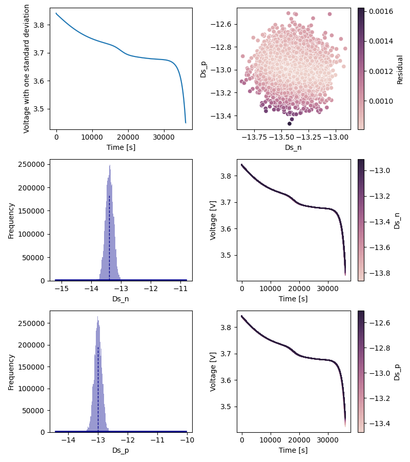

# Summary
Batteries are used ubiquitously in modern technology from mobile phones to electrical vehicles. 
Battery control design, state monitoring, fault diagnosis, thermal management and accelerated research all rely on computational battery models [@howey2020, @planella2022, @masias2021]. 
Continuum scale battery models - such as the Doyle Fuller Newman (DFN) and Single Particle Model (SPM) - are among the most commonly used [@barcellona]. 
The fidelity of these models depends on the accuracy of tens of physicochemical parameter values in terms of which they are specified.
Direct empirical measurement of these parameters is difficult, expensive and sometimes impossible [@li]. 
Numerous algorithms (genetic algorithms, localized sensitivity etc.) have been applied to fit models to experimental battery cycling data [@zhao, @streb, @andersson]. 
However, a pre-cursor to carrying out parameter identification for a complex non-linear model is quantify the extent to which a set of unique, physically-relevant parameters can be estimated from the given data. 
This involves practical identifiabilty analysis. 

`PyBaMM-Bayes` is a Python package for practical identifiability analysis and parameter estimation for electrochemical battery models.  It serves as an extension to the `PyBaMM` [@pybamm] battery modelling framework, combining it with Bayesian optimization libraries (`PINTS` [@pints] and `ELFI` [@elfi]). 

# Statement of need

`PyBaMM-Bayes` makes it efficient and accessible to apply bayesian methods to battery model parameterization problems. 
The use of bayesian parameterization provides precise uncertainty estimates for battery model parameters. 
These uncertainty estimates are difficult to ascertain otherwise given the highly non-linear and coupled nature of equations used to describe battery phenomenon [@berliner, @aitio]. 
The approach used allows complex target distributions to be estimated, which enables a global analysis of the parameter space and ensures that global (rather than sub-optimal local) minima can be found [@galuppini]. 

Practical identifiabilty analysis on models is conducted by fitting parameter distributions to synthetic data simulated using the model (which maybe any valid PyBaMM model). 
To sample parameter space either MCMC (Markov Chain Monte Carlo) or BOLFI (Bayesian Optimization for Likelihood Free Inference) algorithms may be used. 
Any gradient-free MCMC sampler implemented in the `PINTS` package can be used for sampling. 
Alternatively, for Likelihood Free Inference (LFI) the BOLFI algorithm interfaced via the `ELFI` package can be used. 
Several postprocessing and visualization tools are provided for diagnostics and analysis of results such as chain convergence and autocorrelation plots.
These provide visual and quantitative heuristics for the classification of identifiable and non-identifiable parameter sets.

Parameter estimation is done using a similar approach with parameter distributions being estimated from experimental cycling data provided by the user, rather than from synthetic data. 
The mean of the posterior distribution provides the Maximum Likelihood Estimate (MLE) of the parameter set for the model.


# Examples of use

An example of pairwise identifiability analysis on a DFN model is included below. The identifiability of `D_sn` and and `Ds_p` (effective solid-phase diffusion coefficient in the negative and positive electrodes respectively) is being tested. 
Gaussian priors are used for both parameters. 
The Metropolis Hastings algorithm is used to sample the likelihood with 5 chains and 15000 iterations.

```
import pints
import pybamm

from pybamm_bayes import (
    MCMCIdentifiabilityAnalysis,
    Variable,
    marquis_2019,
)

# Define a prior distribution for each variable
log_prior_Dsn = pints.GaussianLogPrior(-13.4, 1)
log_prior_Dsp = pints.GaussianLogPrior(-12.5, 1)

# Specify variables with name, initial value and prior distribution
# Here both varaible are sample on a log scale
# Hence the prior means and intial values are specified accordingly
Dsn = Variable(name="Ds_n", value=-12.5, prior=log_prior_Dsn)
Dsp = Variable(name="Ds_p", value=-13, prior=log_prior_Dsp)
variables = [Dsn, Ds_p]

# Create parameter set with appropriate inputs
parameter_values = marquis_2019(variables)

# Setup a PyBaMM battery simulation
model = pybamm.lithium_ion.DFN()

simulation = pybamm.Simulation(
    model,
    solver=pybamm.CasadiSolver("fast"),
    parameter_values=parameter_values,
    experiment=pybamm.Experiment(["Discharge at C/10 for 10 hours"]),
)

identifiability_problem = MCMCIdentifiabilityAnalysis(
    battery_simulation=simulation,
    parameter_values=parameter_values,
    variables=variables,
    output="Terminal voltage [V]",
    transform_type="log10",
    noise=0.005, 
    project_tag="example",
)

# Plot synthetic data time series 
identifiability_problem.plot_data()
# Plot prior distribution histograms
identifiability_problem.plot_priors()

chains = identifiability_problem.run(
    burnin=200,
    n_iteration=15_000,
    n_chains=5,
)


identifiability_problem.plot_results_summary(forward_evaluations=400)
```

The summary plot below represents a sample output from an identifiability analysis run. 
The plots in the left hand side column show the synthetic data used for the analysis and the posterior distribution of each parameter respectively. 
In the right hand side column the residual (squared error) over the parameter space and the response of the voltage curve to varying each parameter are plotted. 




# Acknowledgements

# References